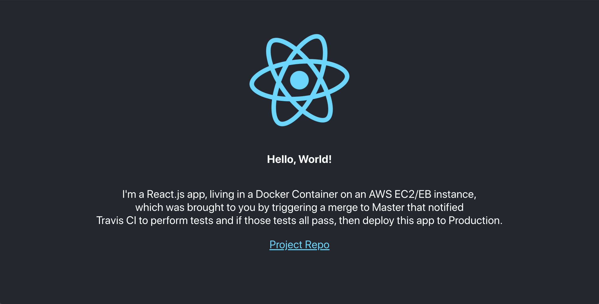

# Docker SPA Demo

A demo application leveraging a standard CI/CD pipeline featuring React.js, Node.js, Docker, NGINX, Travis CI, & AWS.



## Overview

This project is intended to serve as an overview for introducing new concepts and ideas around CI/CD to a new or an already existing project.

## Technologies & Frameworks

- [Create React App](https://facebook.github.io/create-react-app/)
- [React](https://reactjs.org/)
- [Docker](https://www.docker.com/)
- [Docker-Compose](https://docs.docker.com/compose/)
- [Nginx](https://www.nginx.com/)
- [Travis CI](https://travis-ci.org/)
- [AWS ElasticBeanstalk](https://aws.amazon.com/elasticbeanstalk/)

## Development & Deployment

There are a few different ways of working with the application code:

**Localhost:**

```
$ npm install
$ npm start
open http://localhost:3000 # if it doesn't open in browser on its own
```

**via Docker:**

```
$ docker-compose up -d
open http://localhost:3000 # if it doesn't open in browser on its own
$ docker-compose down # teardown the containers once you're done!
```

**via AWS EB:**

You'll need to update `.travis.yml` with your AWS credential information and endpoints:

```yaml
deploy:
  provider: elasticbeanstalk
  region: "us-east-2"
  app: "docker-spa-demo"
  env: "DockerSpaDemo-env"
  bucket_name: "elasticbeanstalk-us-east-2-XXXXXXXXXX"
  bucket_path: "docker-spa-demo"
  on:
    branch: master
  access_key_id: $AWS_ACCESS_KEY
  secret_access_key: $AWS_SECRET_KEY
```

Once you've updated this configuration file, just push a change and Travis CI will take care of the rest! Be sure to teardown and cleanup your AWS environment once you're finished as to not incur additional charges.

---
